# ☁️ Advanced Bash Backup Script with AWS S3 Integration

A production-ready Bash script that automates the process of backing up files from a local directory, compressing them into a `.tar.gz` archive, and uploading the archive to an AWS S3 bucket. It also logs all operations and prevents overwriting existing backups.

---

## 📚 Table of Contents

- [Overview](#-overview)
- [How It Works](#-how-it-works)
- [Architecture Diagram](#-architecture-diagram)
- [Visual Guide](#-visual-guide)
- [Test It Locally](#-test-it-locally)
- [Sample Output](#-sample-output)
- [Log File Example](#-log-file-example)
- [Code Breakdown](#-code-breakdown)
- [Potential Improvements](#-potential-improvements)
- [Author](#author)

---

## 📜 Overview

This script:
- Compresses a source directory (`/home/ubuntu/bash`) into a timestamped `.tar.gz` file.
- Saves the compressed backup into `/home/ubuntu/backup`.
- Uploads it to an S3 bucket.
- Logs the process into `logfile.log`.
- Verifies prerequisites like AWS CLI installation.
- Prevents duplicate backups by checking if the file already exists.

---

## 🛠️ How It Works

1. **Declares variables** for paths, file names, and S3 settings.
2. **Checks for AWS CLI** installation.
3. **Verifies backup duplication** before proceeding.
4. **Archives the source directory** with `tar`.
5. **Uploads the archive to S3** using the AWS CLI.
6. **Logs** all activities and messages.

---

## 📊 Architecture Diagram

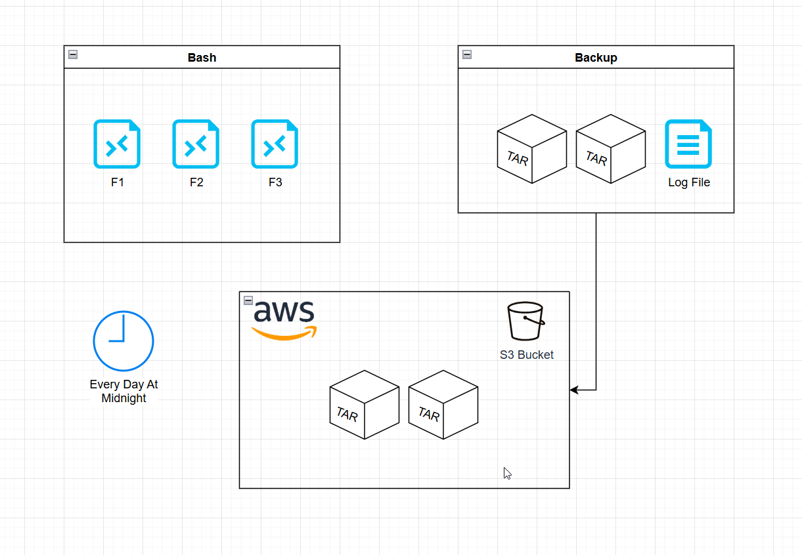

---

## 📸 Visual Guide

| Step | Description                              | Screenshot |
|------|------------------------------------------|------------|
| 01   | Full Script Code                         | 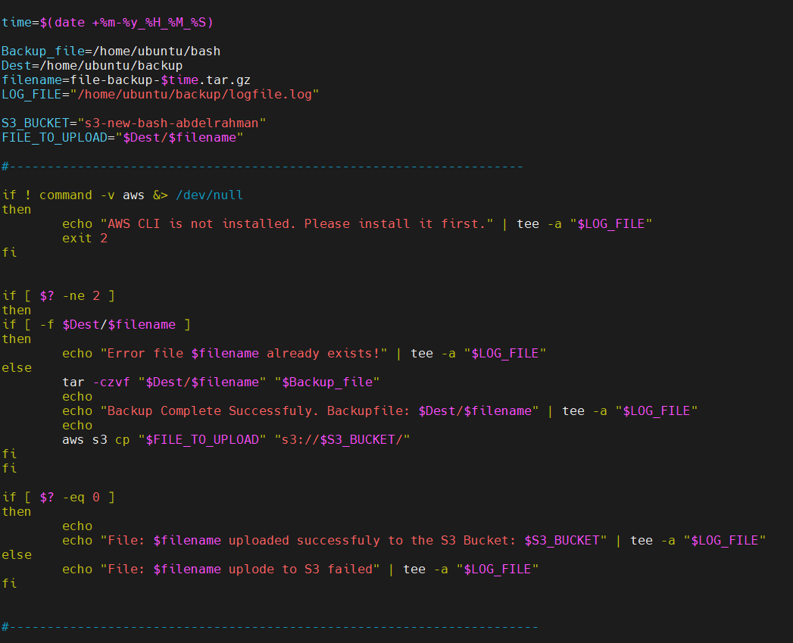 |
| 02   | Declaring Variables                      | 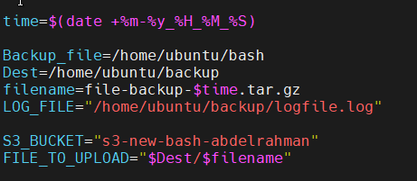 |
| 03   | Check AWS CLI Installation               | 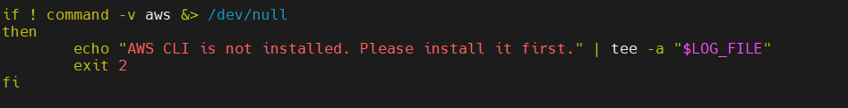 |
| 04   | Preventing Duplicate Backups             | 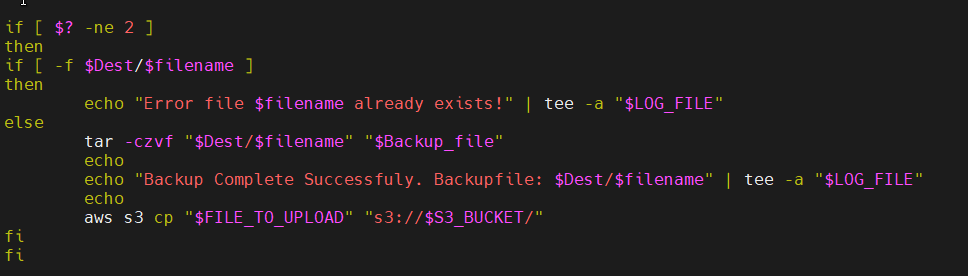 |
| 05   | Uploading to S3                          | 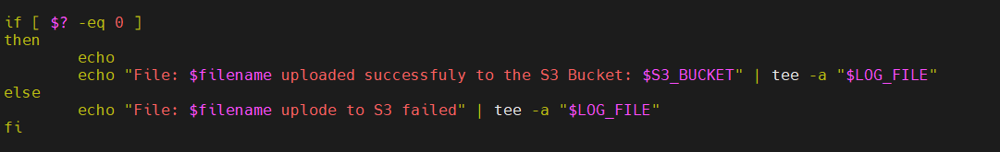 |
| 06   | Crontab Automation                       | 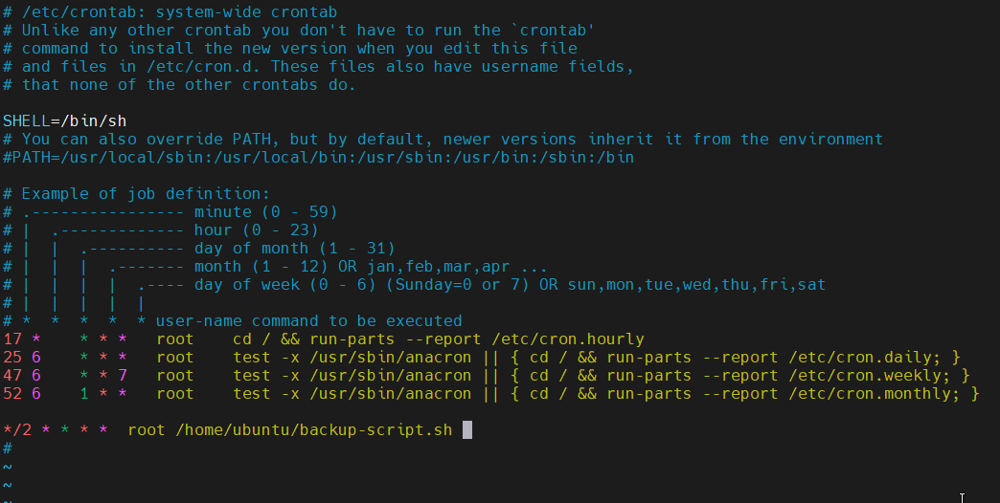 |
| 07   | Local Backup Copies                      | 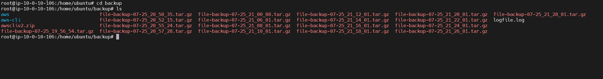 |
| 08   | S3 Console View                          | 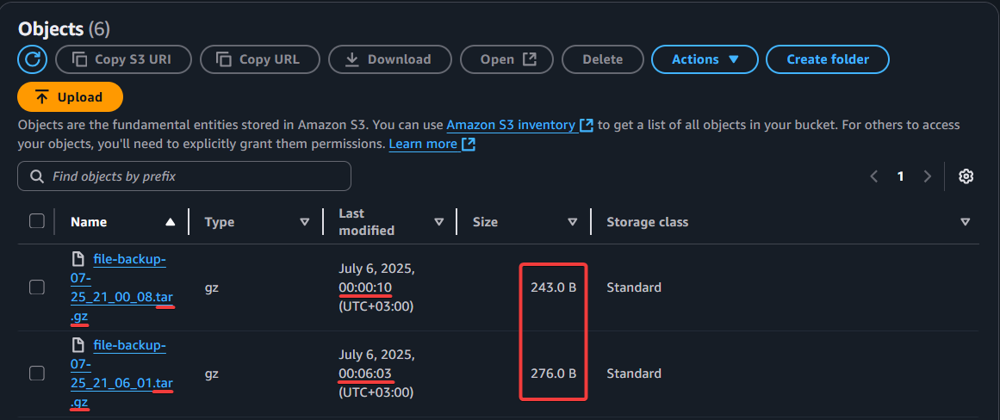 |
| 09   | Log File Snapshot                        | 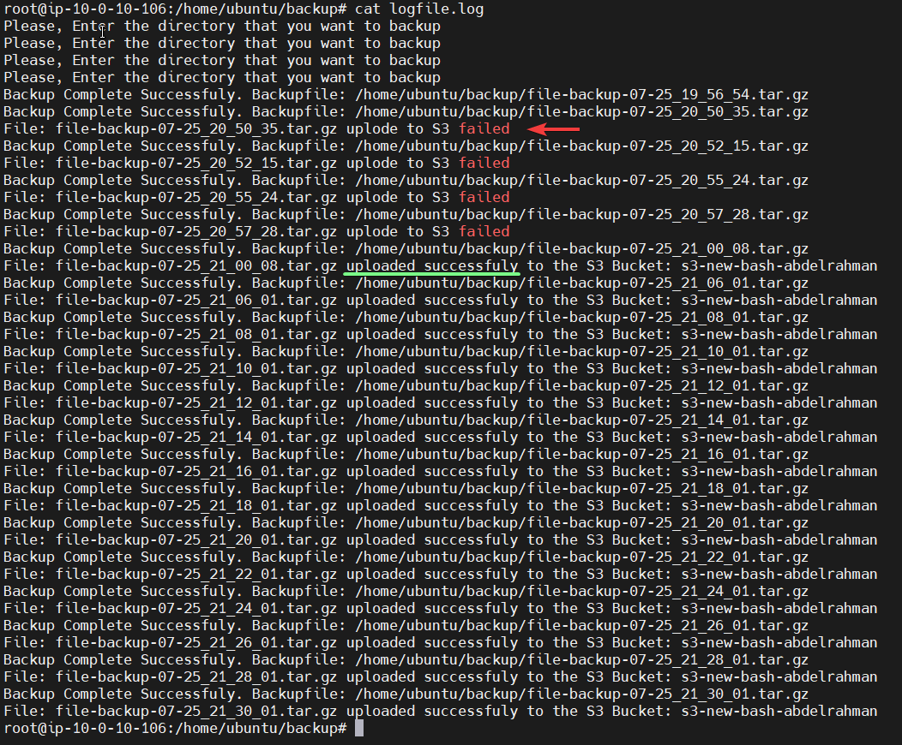 |
| 11   | Original Source Files                    | 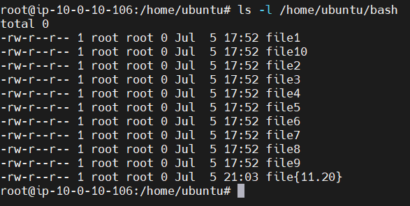 |
| 12   | AWS Configuration Check                  | 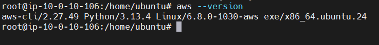 |
| 13   | Zipped Backup File                       | 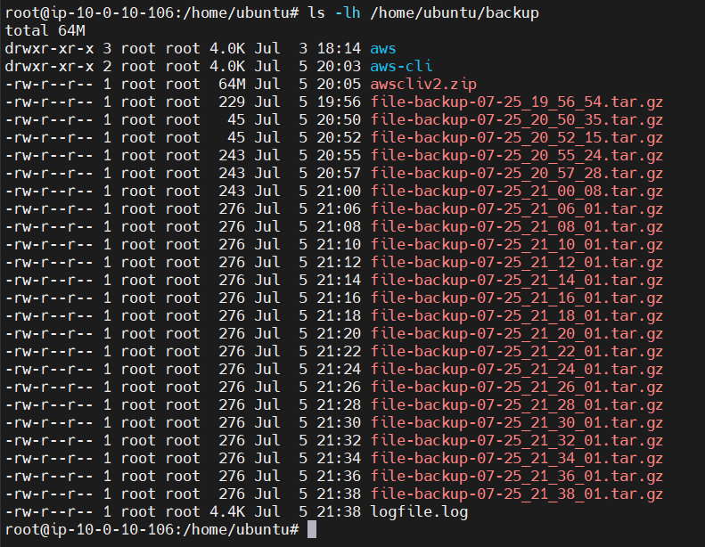 |
| 14   | Upload Output from Terminal              | 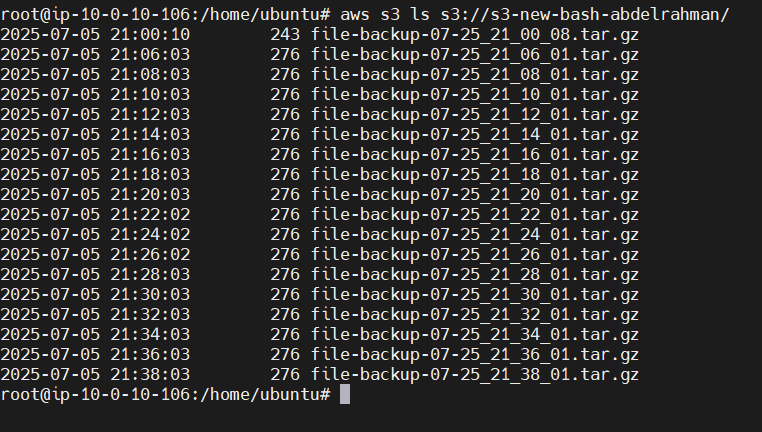 |

---

## 🧪 Test It Locally

1. **Configure AWS CLI**:
   ```bash
   aws configure
   ```

2. **Edit script variables** to match your paths and bucket:
   ```bash
   Backup_file=/your/source/dir
   Dest=/your/destination/dir
   S3_BUCKET="your-bucket-name"
   ```

3. **Make executable & run**:
   ```bash
   chmod +x backup-script.sh
   ./backup-script.sh
   ```

---

## 📦 Sample Output

```
Backup Complete Successfully. Backupfile: /home/ubuntu/backup/file-backup-07-14_07_00_00.tar.gz
File: file-backup-07-14_07_00_00.tar.gz uploaded successfully to the S3 Bucket: s3-new-bash-abdelrahman
```

---

## 📝 Log File Example

```
AWS CLI is not installed. Please install it first.
Backup Complete Successfully. Backupfile: /home/ubuntu/backup/file-backup-07-14_07_00_00.tar.gz
File: file-backup-07-14_07_00_00.tar.gz uploaded successfully to the S3 Bucket: s3-new-bash-abdelrahman
```

---

## 🧠 Code Breakdown

The full annotated code is explained in the screenshots section above (see `01-script-code.png` and others).

---

## 🚀 Potential Improvements

- Add exclusion filters (e.g., skip `.log` files).
- Support encryption (e.g., GPG before upload).
- Retention policy: auto-delete backups older than X days.
- Add email or webhook notifications.

---

## Author

Made by [@abdlrhmanfahd](https://github.com/abdlrhmanfahd)
